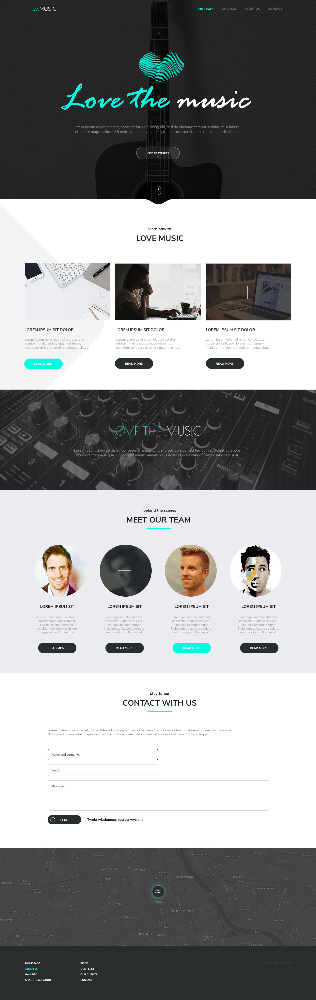

# Warsztat LoveTheMusic

Zadanie polega na napisanie layoutu projektu strony LoveTheMusic zgodnie z obrazkiem poniżej:

Zadanie należy wykonać w pliku `index.html`. Wszystkie style powinny zostać napisane w preprocesorze SASS.
